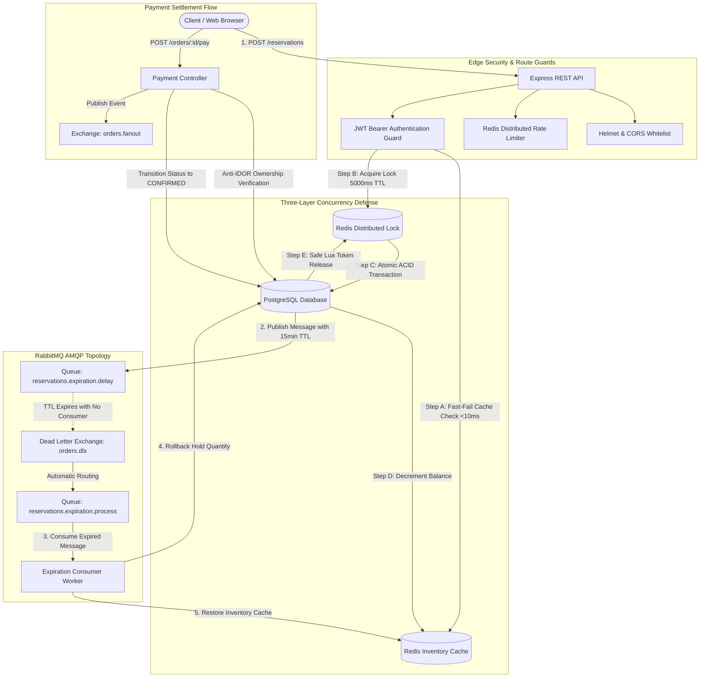

# Event-Driven High-Concurrency Ticketing System

<div align="center">

[](https://nodejs.org/)
[](https://www.typescriptlang.org/)
[](https://expressjs.com/)
[](https://www.postgresql.org/)
[](https://redis.io/)
[](https://www.rabbitmq.com/)
[](https://jestjs.io/)
[](https://k6.io/)
[](https://www.docker.com/)
[](LICENSE)

<br />

**A distributed, event-driven ticketing platform engineered for extreme concurrency traffic (Flash Sales), mathematically guaranteeing Zero Overselling through multi-layer defense mechanisms and asynchronous messaging.**

<br />

**Language:** **English** | [Português (Brasil)](README.pt-BR.md)

</div>

---

## Table of Contents

- [1. System Overview](#1-system-overview)
- [2. Engineering Highlights](#2-engineering-highlights)
- [3. Architecture & Data Flow](#3-architecture--data-flow)
- [4. Concurrency Defense Model](#4-concurrency-defense-model)
- [5. Load Testing & Benchmark Results](#5-load-testing--benchmark-results)
- [6. REST API Specification](#6-rest-api-specification)
- [7. Local Setup & Execution](#7-local-setup--execution)
- [8. Test Suite & Validation](#8-test-suite--validation)
- [9. Repository Structure](#9-repository-structure)
- [10. Technical Documentation](#10-technical-documentation)
- [11. License](#11-license)

---

## 1. System Overview

During high-demand ticket sales (stadium concerts, music festivals, keynote summits), web applications face massive concurrency bursts. Standard database transactions often succumb to connection starvation, race conditions, deadlocks, and catastrophic overselling.

This platform resolves these challenges by separating high-speed inventory reservation from asynchronous settlement and lifecycle management, providing:
- Strict **Zero Overselling** guarantees under concurrent spikes.
- Sub-second response times for reservation holds ($p95 < 300\text{ ms}$).
- Autonomous, polling-free inventory rollback via AMQP message delays.
- Full isolation against Insecure Direct Object References (Anti-IDOR).

---

## 2. Engineering Highlights

- **Mathematical Zero Overselling Invariant:** Capacity formula $\text{reservedQty} + \text{soldQty} \le \text{totalQty}$ is preserved across distributed application instances under load.
- **Polling-Free Event-Driven Expiration:** Unsettled reservations expire via RabbitMQ Dead Letter Exchange (`orders.dlx`) with native message TTL, avoiding periodic polling (`cron`) database scans.
- **Safe Distributed Locking via Lua Scripts:** Mutex acquisition uses unique tokens and automatic TTL. Release operations are verified via atomic Lua scripts to prevent cross-process deallocations.
- **Edge Security & Rate Limiting:**
  - Standard security headers via **Helmet** (`nosniff`, `SAMEORIGIN`, removal of `X-Powered-By`).
  - Origin whitelisting via strict **CORS** middleware.
  - Distributed rate limiting backed by **Redis Store** (`express-rate-limit`).
  - Strict tenant boundary enforcement (`403 Forbidden` on cross-tenant mutations).
- **Automated Mathematical Reconciliation:** Dedicated post-test verification script confirming exact parity between Redis inventory counters and PostgreSQL relational records.

---

## 3. Architecture & Data Flow



---

## 4. Concurrency Defense Model

Reservations pass through three complementary layers of defense:

### Layer 1: Optimistic Fast-Fail Cache (Redis)
Before acquiring distributed locks or opening database connections, requests inspect the in-memory counter `ticket_tier:<id>:available`. When capacity is exhausted, excess requests are rejected in $< 10\text{ ms}$, shielding PostgreSQL and lock queues from contention.

### Layer 2: Distributed Locking with Safe Release (Redis)
Lock keys (`lock:ticket_tier:<id>`) are acquired with a unique UUID token and a safety TTL (5000ms). Deallocation is performed via an atomic Lua script:

```lua
if redis.call('get', KEYS[1]) == ARGV[1] then
    return redis.call('del', KEYS[1])
else
    return 0
end
```

### Layer 3: Row-Level ACID Transaction (PostgreSQL)
Guarded by the lock, an isolated transaction re-verifies inventory balance, increments `reservedQty`, and writes the pending order. The Redis cache counter is then decremented to maintain strict real-time parity.

---

## 5. Load Testing & Benchmark Results

High-concurrency stress test executed via **k6** simulating **100 authenticated Virtual Users (VUs)** contending for a limited capacity of **10 tickets** in the same second:

| Metric | Target Threshold | Measured Result | Verdict |
| :--- | :---: | :---: | :---: |
| **Allocated Reservations** | Exactly 10 tickets | **10 tickets (100% capacity)** | PASSED |
| **Excess Requests Rejected** | 90 requests (400/409) | **90 requests rejected cleanly** | PASSED |
| **Unhandled 500 Errors** | 0 errors | **0 errors (0.00%)** | PASSED |
| **Latency p95 (Confirmed Holds)** | $< 800\text{ ms}$ | **$284.05\text{ ms}$** | PASSED |
| **Latency p99 (Confirmed Holds)** | $< 1500\text{ ms}$ | **$288.59\text{ ms}$** | PASSED |
| **Average Latency (Confirmed Holds)** | - | **$201.78\text{ ms}$** | PASSED |
| **Reconciliation Parity (Redis vs PG)** | Difference = 0 | **Identical (`0 == 0`)** | PASSED |

---

## 6. REST API Specification

| Method | Endpoint | Authentication | Description | Expected Status |
| :---: | :--- | :---: | :--- | :---: |
| `GET` | `/health` | None | Operational status of PostgreSQL, Redis, and RabbitMQ | `200`, `503` |
| `POST` | `/auth/register` | None | User registration with Bcrypt password hashing | `201`, `409` |
| `POST` | `/auth/login` | None | Credential authentication issuing signed JWT token | `200`, `401` |
| `POST` | `/reservations` | Bearer JWT | Atomic ticket reservation with distributed locking | `201`, `200`, `400`, `409` |
| `POST` | `/orders/:id/pay` | Bearer JWT | Payment settlement transitioning order to `CONFIRMED` | `200`, `400`, `403`, `404` |
| `POST` | `/orders/:id/cancel` | Bearer JWT | Voluntary cancellation with immediate inventory rollback | `200`, `400`, `403`, `404` |

---

## 7. Local Setup & Execution

### Prerequisites

- [Node.js](https://nodejs.org/) (version 20 or higher)
- [Docker](https://www.docker.com/) & [Docker Compose](https://docs.docker.com/compose/)

### Step 1: Clone Repository and Install Dependencies

```bash
git clone https://github.com/duduvf11/event-driven-ticketing-system.git
cd event-driven-ticketing-system
npm install
```

### Step 2: Environment Configuration

```bash
cp .env.example .env
```

Review `.env` parameters if default local ports differ:
- Application port: `3000`
- PostgreSQL: `localhost:5432`
- Redis: `localhost:6380` (or `6379`)
- RabbitMQ: `localhost:5672` (Management: `15672`)

### Step 3: Infrastructure Provisioning

```bash
docker compose up -d postgres redis rabbitmq
```

Verify service health:
```bash
docker compose ps
```

### Step 4: Database Migrations & Seeding

```bash
npx prisma migrate dev
npx prisma db seed
```

### Step 5: Start Development Server

```bash
npm run dev
```

The server is available at `http://localhost:3000`. Test responsiveness:
```bash
curl http://localhost:3000/health
```

---

## 8. Test Suite & Validation

### Automated End-to-End Integration Tests (Jest + Supertest)

Executes 3 test suites covering 14 integration scenarios across network security, authentication, route guards, distributed locks, idempotency keys, and state machine integrity:

```bash
npm test
```

### High-Concurrency Load Testing (k6 Flash Sale)

Execute the end-to-end stress testing pipeline:

```bash
# 1. Seed test event, ticket tier, and provision JWT tokens for 100 Virtual Users
npm run load:setup

# 2. Run k6 concurrent flash-sale simulation via Docker
npm run load:run

# 3. Execute mathematical reconciliation audit
npm run load:audit
```

---

## 9. Repository Structure

```
event-driven-ticketing-system/
├── docker-compose.yml          # Infrastructure container definitions
├── docs/                       # Detailed requirements and architectural specifications
│   ├── architecture.md         # Architecture Document (English)
│   ├── architecture.pt-BR.md   # Architecture Document (Portuguese)
│   ├── requirements.md         # Requirements Document (English)
│   └── requirements.pt-BR.md   # Requirements Document (Portuguese)
├── prisma/                     # Database schema definition, migrations, and seeds
│   ├── schema.prisma
│   └── seed.ts
├── scripts/                    # Load-test provisioning and post-test reconciliation audit
│   ├── setup-load-test.ts
│   └── validate-load-test.ts
├── src/                        # Application source code
│   ├── app.ts                  # Decoupled Express application instance
│   ├── server.ts               # Infrastructure bootstrap and HTTP listener
│   ├── config/                 # Database, Redis, and RabbitMQ client configurations
│   ├── controllers/            # HTTP request controllers
│   ├── messaging/              # AMQP publishers, consumers, and DLX topology setup
│   ├── middlewares/            # Authentication, rate limiting, and security middlewares
│   ├── repositories/           # Data access layer
│   ├── services/               # Domain business logic and concurrency controls
│   └── utils/                  # Redis Distributed Lock with Lua deallocation script
└── tests/                      # Automated test suites
    ├── integration/            # Supertest + Jest integration specs
    └── load/                   # k6 scenario definitions
```

---

## 10. Technical Documentation

For detailed specifications, consult the dedicated documentation:
- [System Architecture & Data Engineering](docs/architecture.md)
- [System Requirements & Business Rules](docs/requirements.md)

---

## 11. License

This project is licensed under the terms of the [MIT License](LICENSE).
