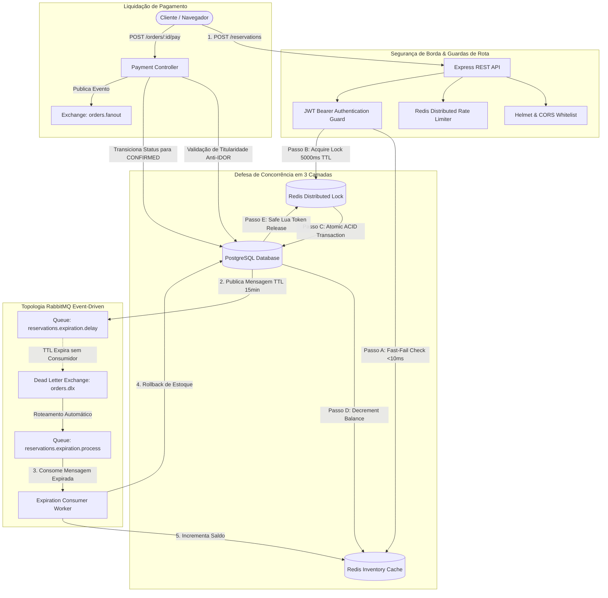

# Event-Driven High-Concurrency Ticketing System

<div align="center">

[](https://nodejs.org/)
[](https://www.typescriptlang.org/)
[](https://expressjs.com/)
[](https://www.postgresql.org/)
[](https://redis.io/)
[](https://www.rabbitmq.com/)
[](https://jestjs.io/)
[](https://k6.io/)
[](https://www.docker.com/)
[](LICENSE)

<br />

**Uma plataforma resiliente e orientada a eventos para emissão e reserva de ingressos sob tráfego de concorrência extrema (Flash Sales), garantindo matematicamente Zero Overselling através de defesas em camadas e mensageria assíncrona.**

<br />

**Idioma:** [English](README.md) | **Português (Brasil)**

</div>

---

## Sumário

- [1. Visão Geral do Sistema](#1-visão-geral-do-sistema)
- [2. Destaques de Engenharia](#2-destaques-de-engenharia)
- [3. Arquitetura e Fluxo de Dados](#3-arquitetura-e-fluxo-de-dados)
- [4. Modelo de Defesa de Concorrência](#4-modelo-de-defesa-de-concorrência)
- [5. Resultados de Benchmark e Teste de Carga](#5-resultados-de-benchmark-e-teste-de-carga)
- [6. Especificação da API REST](#6-especificação-da-api-rest)
- [7. Instalação e Execução Local](#7-instalação-e-execução-local)
- [8. Bateria de Testes e Validação](#8-bateria-de-testes-e-validação)
- [9. Estrutura do Repositório](#9-estrutura-do-repositório)
- [10. Documentações Técnicas](#10-documentações-técnicas)
- [11. Licença](#11-licença)

---

## 1. Visão Geral do Sistema

Em eventos de alta demanda (shows em estádios, festivais e conferências globais), aplicações web enfrentam picos repentinos de concorrência massiva. Modelos tradicionais de transação de banco de dados costumam sucumbir à exaustão de conexões, *race conditions*, *deadlocks* e alocação duplicada de estoque (*Overselling*).

Esta plataforma resolve esses desafios isolando a etapa de alta velocidade de reserva temporária da liquidação financeira e manutenção do ciclo de vida, garantindo:

- Garantia estrita de **Zero Overselling** sob concorrência extrema.
- Tempo de resposta sub-segundo para criação de reservas ($p95 < 300\text{ ms}$).
- Liberação autônoma de inventário expirado via mensageria AMQP (sem *polling* em banco).
- Isolamento total contra acessos indevidos entre contas (Anti-IDOR).

---

## 2. Destaques de Engenharia

- **Invariante Matemática de Zero Overselling:** A fórmula $\text{reservedQty} + \text{soldQty} \le \text{totalQty}$ é estritamente preservada entre nós distribuídos da aplicação sob estresse.
- **Expiração Orientada a Eventos sem Polling:** Reservas não liquidadas expiram passivamente no RabbitMQ com TTL nativo de mensagem; ao expirar, uma Dead Letter Exchange (`orders.dlx`) roteia a mensagem para o worker que restaura o inventário atomicamente.
- **Lock Distribuído Seguro via Scripts Lua:** A aquisição de travas utiliza tokens randômicos e TTL automático. A desalocação é executada por scripts Lua atômicos que impedem que um nó libere a trava de outro processo.
- **Segurança de Borda e Rate Limiting:**
  - Headers HTTP seguros via **Helmet** (`nosniff`, `SAMEORIGIN`, remoção de `X-Powered-By`).
  - Whitelist de origens via middleware de **CORS** restritivo.
  - Rate limiting distribuído com backend no **Redis** (`express-rate-limit`).
  - Barreira de autorização **Anti-IDOR** rejeitando acessos entre tenants com `403 Forbidden`.
- **Auditoria Contábil Automatizada:** Script de verificação pós-teste que atesta paridade exata entre os contadores de inventário no Redis e os registros relacionais no PostgreSQL.

---

## 3. Arquitetura e Fluxo de Dados



---

## 4. Modelo de Defesa de Concorrência

As requisições de reserva passam por três camadas de proteção complementares:

### Camada 1: Cache Otimista Fast-Fail (Redis)

Antes de disputar locks distribuídos ou abrir transações no banco de dados, a requisição verifica o contador em memória `ticket_tier:<id>:available`. Quando a capacidade atinge zero, requisições excedentes são rejeitadas em $< 10\text{ ms}$, blindando o PostgreSQL contra saturação.

### Camada 2: Lock Distribuído com Liberação Segura (Redis)

A chave de trava (`lock:ticket_tier:<id>`) é adquirida com um token UUID randômico e TTL de segurança (5000ms). A liberação ocorre através de script Lua atômico:

```lua
if redis.call('get', KEYS[1]) == ARGV[1] then
    return redis.call('del', KEYS[1])
else
    return 0
end
```

### Camada 3: Transação ACID em Nível de Linha (PostgreSQL)

Sob a proteção da trava, uma transação isolada revalida o saldo no banco, incrementa `reservedQty` e persiste o pedido em estado `PENDING`. Em seguida, o saldo no Redis é decrementado para manter paridade em tempo real.

---

## 5. Resultados de Benchmark e Teste de Carga

Teste de estresse em alta concorrência executado via **k6** simulando **100 Virtual Users (VUs)** autenticados disputando um lote de **10 ingressos** no mesmo segundo:

| Métrica | Meta do Threshold | Resultado Medido | Veredito |
| :--- | :---: | :---: | :---: |
| **Reservas Concedidas** | Exatamente 10 ingressos | **10 ingressos (100% da capacidade)** | APROVADO |
| **Requisições Excedentes Rejeitadas** | 90 requisições (400/409) | **90 rejeitadas ordenadamente** | APROVADO |
| **Erros 500 Não Tratados** | 0 erros | **0 erros (0.00%)** | APROVADO |
| **Latência p95 (Reservas Confirmadas)** | $< 800\text{ ms}$ | **$284.05\text{ ms}$** | APROVADO |
| **Latência p99 (Reservas Confirmadas)** | $< 1500\text{ ms}$ | **$288.59\text{ ms}$** | APROVADO |
| **Latência Média (Reservas Confirmadas)** | - | **$201.78\text{ ms}$** | APROVADO |
| **Paridade Contábil (Redis vs PG)** | Diferença = 0 | **Idêntico (`0 == 0`)** | APROVADO |

---

## 6. Especificação da API REST

| Método | Endpoint | Autenticação | Descrição | Status Esperado |
| :---: | :--- | :---: | :--- | :---: |
| `GET` | `/health` | Nenhuma | Estado operacional do PostgreSQL, Redis e RabbitMQ | `200`, `503` |
| `POST` | `/auth/register` | Nenhuma | Registro de usuário com senha criptografada via Bcrypt | `201`, `409` |
| `POST` | `/auth/login` | Nenhuma | Autenticação de credenciais e emissão de token JWT | `200`, `401` |
| `POST` | `/reservations` | Bearer JWT | Reserva atômica com distributed lock e idempotência | `201`, `200`, `400`, `409` |
| `POST` | `/orders/:id/pay` | Bearer JWT | Liquidação de pagamento e transição para `CONFIRMED` | `200`, `400`, `403`, `404` |
| `POST` | `/orders/:id/cancel` | Bearer JWT | Cancelamento voluntário com rollback de estoque imediato | `200`, `400`, `403`, `404` |

---

## 7. Instalação e Execução Local

### Pré-requisitos

- [Node.js](https://nodejs.org/) (versão 20 ou superior)
- [Docker](https://www.docker.com/) e [Docker Compose](https://docs.docker.com/compose/)

### Passo 1: Clonar o Repositório e Instalar Dependências

```bash
git clone https://github.com/duduvf11/event-driven-ticketing-system.git
cd event-driven-ticketing-system
npm install
```

### Passo 2: Configuração de Ambiente

```bash
cp .env.example .env
```

Revise as variáveis no arquivo `.env` caso suas portas locais padrão difiram:

- Porta da aplicação: `3000`
- PostgreSQL: `localhost:5432`
- Redis: `localhost:6380` (ou `6379`)
- RabbitMQ: `localhost:5672` (Interface Web: `15672`)

### Passo 3: Provisionar a Infraestrutura em Contêineres

```bash
docker compose up -d postgres redis rabbitmq
```

Verifique o status dos serviços:

```bash
docker compose ps
```

### Passo 4: Executar Migrações do Banco e Seeds

```bash
npx prisma migrate dev
npx prisma db seed
```

### Passo 5: Iniciar o Servidor de Desenvolvimento

```bash
npm run dev
```

A API estará em operação em `http://localhost:3000`. Teste o endpoint de integridade:

```bash
curl http://localhost:3000/health
```

---

## 8. Bateria de Testes e Validação

### Testes Automatizados de Integração End-to-End (Jest + Supertest)

Executa 3 suítes de testes cobrindo 14 cenários críticos (segurança de rede, autenticação, guardas de rota, locks distribuídos, chaves de idempotência e máquina de estados):

```bash
npm test
```

### Teste de Carga e Estresse em Concorrência (k6 Flash Sale)

Execute o pipeline completo de testes de estresse:

```bash
# 1. Cria lote isolado e gera tokens JWT para 100 Virtual Users
npm run load:setup

# 2. Dispara a simulação de concorrência com k6 via Docker
npm run load:run

# 3. Executa o script de auditoria de paridade contábil e Zero Overselling
npm run load:audit
```

---

## 9. Estrutura do Repositório

```
event-driven-ticketing-system/
├── docker-compose.yml          # Definições de infraestrutura dos contêineres
├── docs/                       # Especificações aprofundadas de arquitetura e requisitos
│   ├── architecture.md         # Documento de Arquitetura (Inglês)
│   ├── architecture.pt-BR.md   # Documento de Arquitetura (Português)
│   ├── requirements.md         # Documento de Requisitos (Inglês)
│   └── requirements.pt-BR.md   # Documento de Requisitos (Português)
├── prisma/                     # Esquema do banco de dados relacional, migrações e seeds
│   ├── schema.prisma
│   └── seed.ts
├── scripts/                    # Scripts de setup de carga e auditoria de reconciliação
│   ├── setup-load-test.ts
│   └── validate-load-test.ts
├── src/                        # Código-fonte da aplicação
│   ├── app.ts                  # Instância e pipeline Express desacoplada
│   ├── server.ts               # Inicialização de infraestrutura e listener HTTP
│   ├── config/                 # Clientes de banco de dados, Redis e RabbitMQ
│   ├── controllers/            # Controladores de requisições HTTP
│   ├── messaging/              # Publishers, consumidores e topologia AMQP DLX
│   ├── middlewares/            # Middlewares de autenticação, rate limit e segurança
│   ├── repositories/           # Camada de acesso a dados
│   ├── services/               # Regras de negócio e travas de concorrência
│   └── utils/                  # Distributed Lock no Redis com desalocação segura em Lua
└── tests/                      # Baterias de testes automatizados
    ├── integration/            # Testes de integração E2E com Supertest + Jest
    └── load/                   # Definições de cenários de carga com k6
```

---

## 10. Documentações Técnicas

Para especificações detalhadas de engenharia, consulte os documentos dedicados:

- [Arquitetura do Sistema e Engenharia de Dados](docs/architecture.pt-BR.md)
- [Documento de Requisitos e Regras de Negócio](docs/requirements.pt-BR.md)

---

## 11. Licença

Este projeto está licenciado sob os termos da [Licença MIT](LICENSE).
