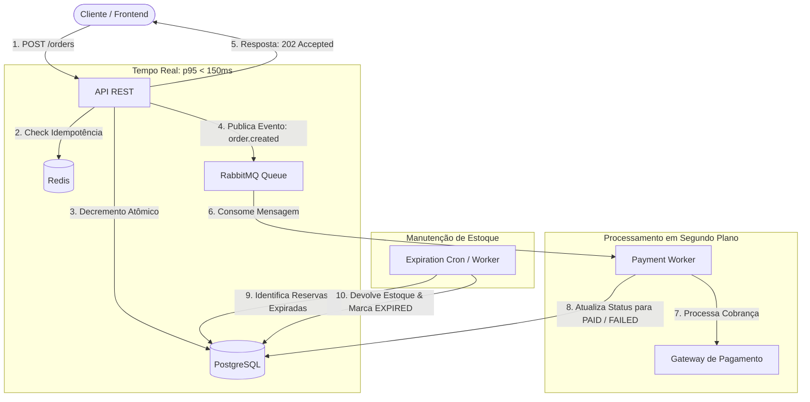
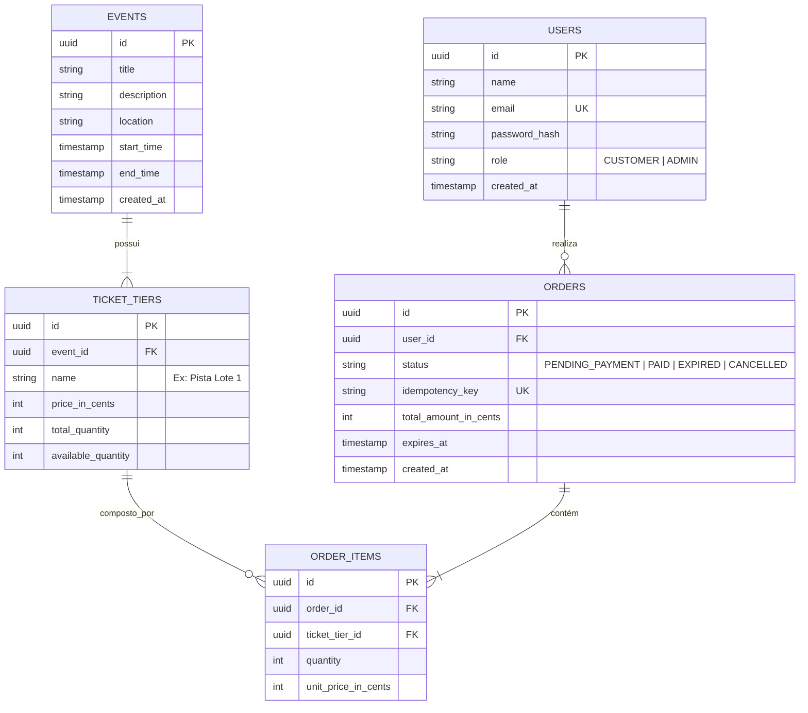

# Arquitetura do Sistema e Fluxo de Dados

**Projeto:** Event-Driven Ticketing System

---

## 1. Visão Geral da Arquitetura

O sistema adota uma arquitetura orientada a eventos (*Event-Driven Architecture*) para desacoplar a etapa crítica de reserva temporária de ingressos da etapa de processamento financeiro e liquidação de pedidos.

---

## 2. Diagrama Entidade-Relacionamento (ER)

O modelo relacional foi desenhado para isolar o estoque por lote (`ticket_tiers`) e garantir a integridade referencial dos pedidos:

---

## 3. Principais Decisões Arquiteturais e Trade-offs

1. **Separação entre Reserva e Pagamento:**
   * **Decisão:** A API só reserva o recurso no PostgreSQL e envia para a fila do RabbitMQ.
   * **Trade-off:** O cliente não recebe o status final imediatamente na resposta HTTP; ele recebe `202 Accepted` e consulta o status ou aguarda notificação via polling/webhook. Em troca, a API suporta picos massivos de tráfego sem derrubar o banco.

2. **Tipagem Monetária em Inteiros (`*_in_cents`):**
   * **Decisão:** Preços e totais armazenados em centavos (ex: R$ 100,00 $\rightarrow$ `10000`).
   * **Motivo:** Evita inconsistências de arredondamento causadas pela representação binária de números de ponto flutuante (`float`/`double`).
