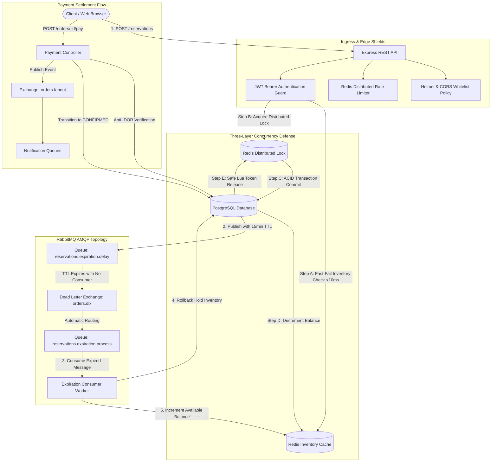
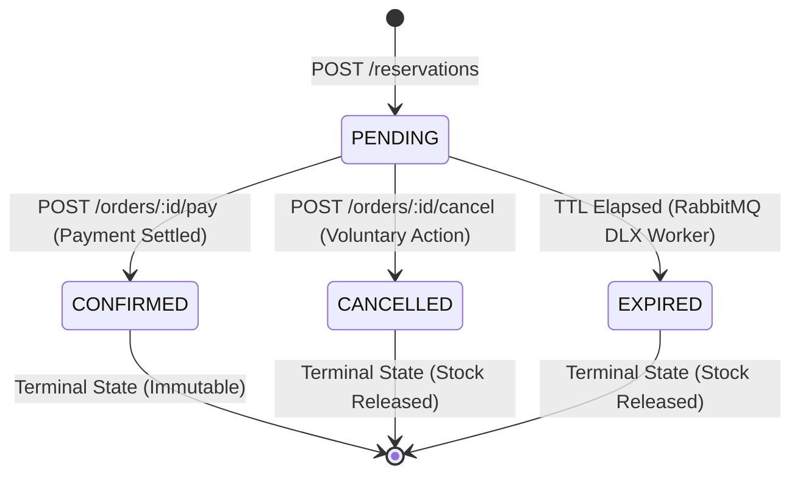
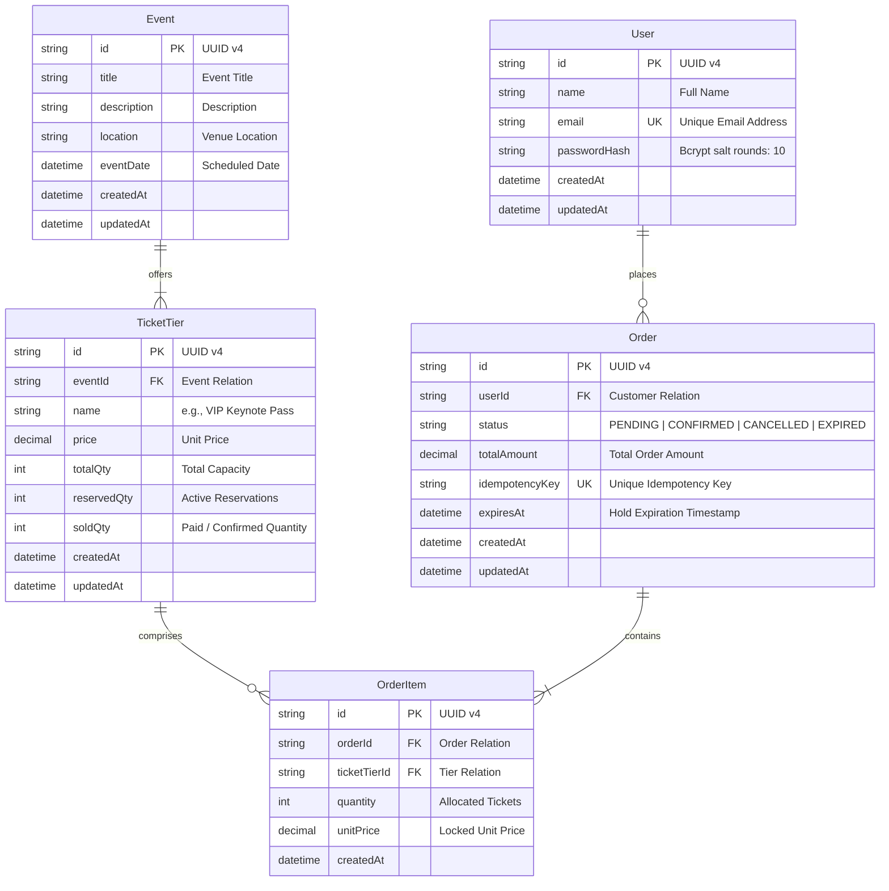

# System Architecture & Data Engineering

> **Project:** Event-Driven High-Concurrency Ticketing System  
> **Status:** Verified & Implemented in Production  
> **Version:** 1.0.0  
> **Language:** English | [Versão em Português](architecture.pt-BR.md)  

---

## 1. Architectural Overview

The system implements an **Event-Driven Architecture (EDA)** engineered to decouple the high-throughput, latency-critical reservation phase from payment settlement and inventory lifecycle maintenance.

### 1.1. Topology & Data Flow Diagram



---

## 2. Three-Layer Concurrency Defense Strategy

To handle high-contention events (*Flash Sales*) without saturating system resources and preventing unnecessary lock queues, reservations pass through three layered defense barriers:

### Layer 1: Optimistic Fast-Fail Cache (Redis)

* **Goal:** Filter out excess demand at the memory boundary.
* **Mechanism:** Before requesting locks or opening PostgreSQL database transactions, the API checks `ticket_tier:<id>:available` in Redis.
* **Impact:** Once a tier sells out, 90% of excess traffic is rejected immediately with `400 Bad Request` in under **$10\text{ ms}$**, eliminating downstream lock contention and database CPU exhaustion.

### Layer 2: Distributed Locking with Unique Tokens & Safe Release (Redis)

* **Goal:** Prevent race conditions across horizontally scaled application nodes.
* **Mechanism:** Acquires a distributed key (`lock:ticket_tier:<id>`) using a unique UUID token, safety TTL (5000ms), and exponential retry backoff.
* **Atomic Deallocation via Lua Script:** Lock release is governed by an atomic Lua script executed directly inside Redis:

  ```lua
  if redis.call('get', KEYS[1]) == ARGV[1] then
      return redis.call('del', KEYS[1])
  else
      return 0
  end
  ```

  This guarantees that a delayed process will never release a lock that already expired and was subsequently acquired by another node.

### Layer 3: Row-Level ACID Transaction (PostgreSQL)

* **Goal:** Absolute transactional integrity and legal state-of-record.
* **Mechanism:** Inside an isolated transaction (`prisma.$transaction`), the tier row is inspected, the invariant capacity formula is asserted (`totalQty - (reservedQty + soldQty) >= requestedQty`), the hold counter is incremented (`reservedQty += qty`), and the pending order is persisted with an expiration timestamp.

---

## 3. Finite State Machine (FSM)

Order state transitions follow a deterministic state machine preventing illegal mutations or duplicate cancellations:



### Transition Invariants

1. **`PENDING` $\rightarrow$ `CONFIRMED`:** Only the authenticated owner can settle (Anti-IDOR). Converts held tickets from `reservedQty` to `soldQty` and dispatches `orders.paid`.
2. **`PENDING` $\rightarrow$ `CANCELLED`:** Voluntarily cancels reservation, restores `reservedQty` in PostgreSQL, and replenishes the Redis availability cache.
3. **`PENDING` $\rightarrow$ `EXPIRED`:** Dead Letter Exchange delivers the expired token to the worker, updating status and releasing inventory back to the pool.
4. **`CONFIRMED` $\rightarrow$ Cancellation Attempt:** Strictly rejected with `400 Bad Request` (*"Cannot cancel an order that has already been paid and confirmed"*).

---

## 4. Entity-Relationship Model (Prisma ERD)

The relational schema ensures strict referential integrity and isolation between users, events, inventory tiers, and purchase orders:



---

## 5. Event-Driven Auto-Expiration via AMQP DLX (Polling-Free)

Unlike legacy systems that rely on expensive database polling intervals (`SELECT WHERE expires_at < NOW()`), this platform utilizes native message-delay routing:

1. **TTL Publishing:** Upon reservation creation, the API schedules a message on the queue `reservations.expiration.delay` configured with `x-message-ttl: 900000` (15 minutes) and bound to Dead Letter Exchange `orders.dlx`.
2. **No Consumers on Delay Queue:** The delay queue maintains zero active consumers; messages reside passively in the broker.
3. **Dead-Letter Routing:** When message TTL expires, RabbitMQ drops the message from the delay queue and automatically routes it via `orders.dlx` into `reservations.expiration.process`.
4. **Worker Processing:** The background worker (`reservation-expiration.consumer.ts`) consumes the event, applies poison pill verification, updates the order status to `EXPIRED`, and releases inventory.

---

## 6. Architectural Decisions & Engineering Trade-offs

| Decision | Alternative Rejected | Engineering Rationale |
| :--- | :--- | :--- |
| **Dead Letter Exchange (DLX) with Message TTL** | Cron Job Poller on Database (`node-cron`) | Completely eliminates repeated database I/O scanning overhead and scales with sub-second delivery accuracy. |
| **Optimistic Fast-Fail via Redis Cache** | Naive Enqueueing on Distributed Lock | Reduces response times for rejected requests from ~9s to $< 10\text{ ms}$, preventing connection pool exhaustion during flash sales. |
| **Distributed Lock (Redis) + ACID (Postgres)** | Pessimistic DB Locking (`SELECT FOR UPDATE`) | Coordinates multiple independent application replicas without table-level database contention or deadlocks under mass concurrency. |
| **Decoupled Express `app.ts` / `server.ts`** | Combined Server Initialization and Port Listen | Enables fast, in-memory end-to-end integration testing via Supertest without network port collisions or dangling socket listeners. |
