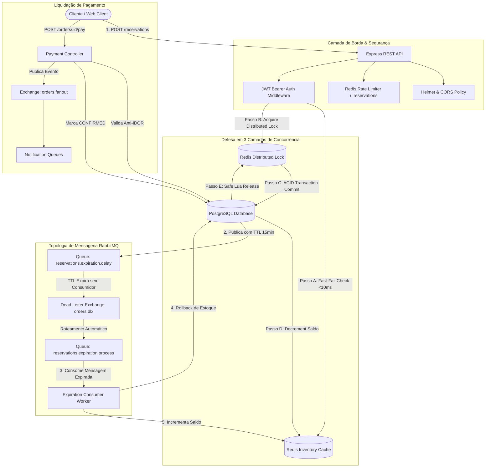
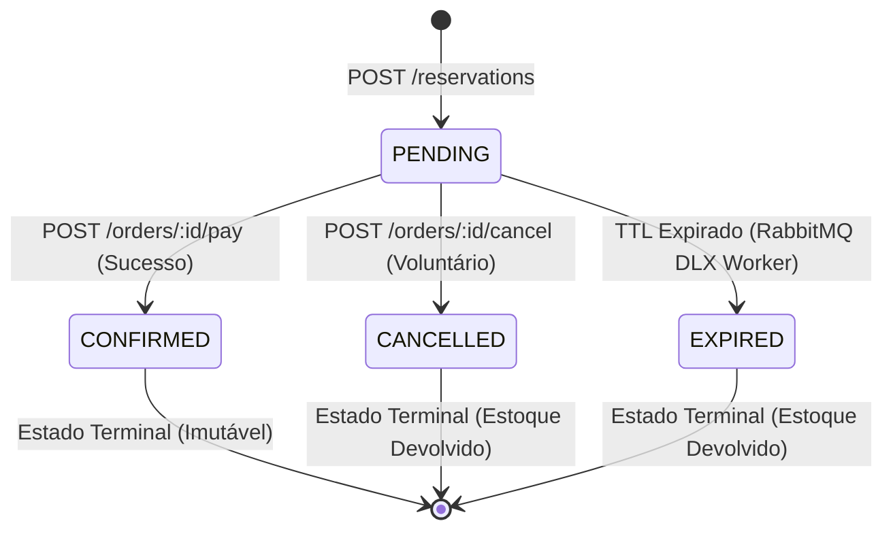
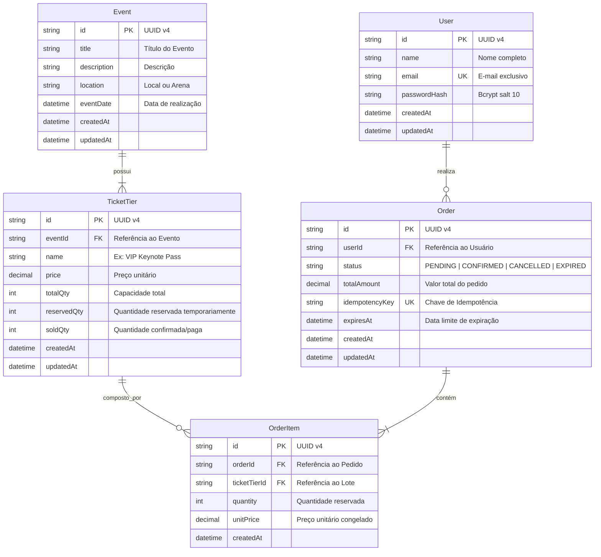

# Arquitetura do Sistema e Engenharia de Dados

> **Projeto:** Event-Driven High-Concurrency Ticketing System  
> **Status:** Homologado & Implementado em Produção  
> **Versão:** 1.0.0  
> **Idioma:** Português (Brasil) | [English Version](architecture.md)  

---

## 1. Visão Geral da Arquitetura

O sistema implementa uma **Arquitetura Orientada a Eventos (EDA)** projetada para isolar a etapa crítica de reserva atômica de ingressos do processamento de pagamento e da manutenção do ciclo de vida de expiração.

### 1.1. Diagrama de Topologia e Fluxo de Dados



---

## 2. A Estratégia de Defesa de Concorrência em Três Camadas

Para liquidar lotes em segundos (*Flash Sales*) sem sobrecarregar a infraestrutura e eliminando filas de espera desnecessárias, a reserva utiliza uma arquitetura de três barreiras complementares:

### Camada 1: *Optimistic Fast-Fail Cache* (Redis)

* **Objetivo:** Filtrar o tráfego excedente no limiar da memória.
* **Mecanismo:** Antes de solicitar locks ou abrir conexões no PostgreSQL, a API consulta `ticket_tier:<id>:available` no Redis.
* **Impacto:** Quando o lote esgota, 90% das requisições são rejeitadas com `400 Bad Request` em menos de **$10\text{ ms}$**, poupando o banco de dados e eliminando esperas em locks.

### Camada 2: *Distributed Lock* com Token Randômico e Safe Release (Redis)

* **Objetivo:** Impedir *Race Conditions* em escala horizontal.
* **Mecanismo:** Aquisição de chave exclusiva (`lock:ticket_tier:<id>`) com token UUID único, tempo de vida (TTL) de segurança de 5000ms e retentativas com backoff exponencial.
* **Liberação Atômica via Script Lua:** A desalocação do lock utiliza um script Lua executado diretamente no motor do Redis:

  ```lua
  if redis.call('get', KEYS[1]) == ARGV[1] then
      return redis.call('del', KEYS[1])
  else
      return 0
  end
  ```

  Isso garante que um processo mais lento jamais libere o lock que já expirou e foi adquirido por outro nó.

### Camada 3: Transação ACID em Nível de Linha (PostgreSQL)

* **Objetivo:** Consistência transacional e autoridade contábil final.
* **Mecanismo:** Dentro de uma transação isolada (`prisma.$transaction`), a linha do lote é consultada, o saldo invariante é comprovado (`totalQty - (reservedQty + soldQty) >= requestedQty`), a reserva é incrementada (`reservedQty += qty`) e o pedido `PENDING` é persistido com data de expiração.

---

## 3. Máquina de Estados Finita (FSM) dos Pedidos

O ciclo de vida das ordens segue uma máquina de estados estrita que previne mutações espúrias e cancelamentos indevidos:



### Regras de Transição

1. **`PENDING` $\rightarrow$ `CONFIRMED`:** Apenas o titular pode pagar (Anti-IDOR). Transfere ingressos de `reservedQty` para `soldQty` e emite o evento `orders.paid`.
2. **`PENDING` $\rightarrow$ `CANCELLED`:** Cancela a reserva voluntariamente, restaura `reservedQty` no banco e incrementa o saldo no Redis.
3. **`PENDING` $\rightarrow$ `EXPIRED`:** O RabbitMQ DLX entrega a mensagem expirada ao worker, que atualiza o status e devolve os ingressos ao inventário.
4. **`CONFIRMED` $\rightarrow$ Tentativa de Cancelamento:** Rejeitado com código `400 Bad Request` (*"Cannot cancel an order that has already been paid and confirmed"*).

---

## 4. Diagrama Entidade-Relacionamento (Prisma ERD)

O esquema relacional garante integridade referencial estrita e isolamento entre eventos, lotes e itens de pedidos:



---

## 5. Arquitetura de Expiração Event-Driven via AMQP DLX (Sem Polling)

Diferente de sistemas legados que dependem de consultas repetitivas de varredura no banco (`SELECT WHERE expires_at < NOW()`), este projeto adota agendamento nativo por mensagens:

1. **Publicação com TTL:** Ao criar a reserva, a API publica uma mensagem na fila `reservations.expiration.delay` configurada com `x-message-ttl: 900000` (15 minutos) e vinculada à Dead Letter Exchange `orders.dlx`.
2. **Sem Consumidor na Fila de Atraso:** A fila de atraso não possui consumidores conectados; as mensagens aguardam passivamente no broker.
3. **Morte e Roteamento para a DLQ:** Ao atingir o TTL, o RabbitMQ descarta a mensagem da fila original e a encaminha automaticamente via `orders.dlx` para a fila de processamento `reservations.expiration.process`.
4. **Processamento no Worker:** O `reservation-expiration.consumer.ts` consome a mensagem, aplica proteção contra *Poison Pills* e transaciona o status do pedido para `EXPIRED`.

---

## 6. Decisões de Arquitetura e Compensações (*Trade-offs*)

| Decisão Tomada | Alternativa Rejeitada | Justificativa Técnica |
| :--- | :--- | :--- |
| **Dead Letter Exchange (DLX) com TTL** | Cron Job Poller no Banco (`node-cron`) | Elimina overhead de I/O de queries periódicas (`SELECT`) no banco de dados e escala com precisão milimétrica de entrega de eventos. |
| **Optimistic Fast-Fail no Redis** | Enfileiramento cego no Distributed Lock | Reduz o tempo de resposta das requisições excedentes de ~9 segundos para $< 10\text{ ms}$, evitando contenção desnecessária de conexões. |
| **Distributed Lock (Redis) + ACID (PG)** | Pessimistic Locking (`SELECT FOR UPDATE`) | Permite coordenação de múltiplos nós e instâncias sem bloquear tabelas inteiras no PostgreSQL ou causar deadlocks sob concorrência massiva. |
| **Desacoplamento `app.ts` / `server.ts`** | Instanciação e listen no mesmo arquivo | Permite execução de testes automatizados via Supertest em memória sem alocação de portas TCP físicas e sem colisões de socket. |
